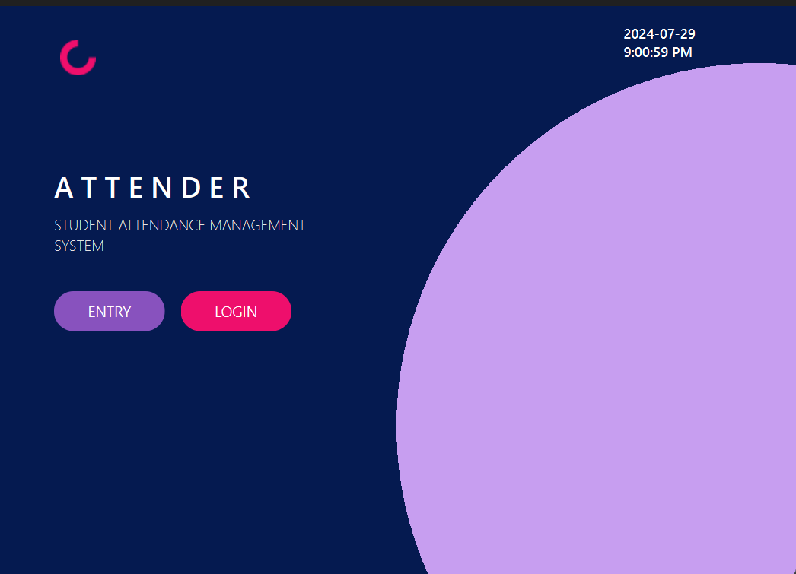
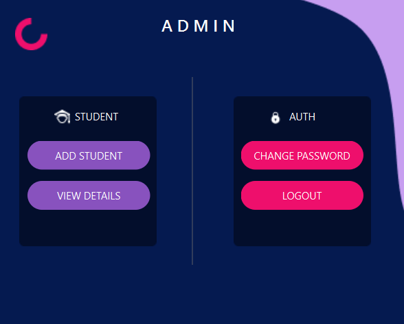

# ATTENDER

ATTENDER (A Students Attendance Management System) is a robust application developed using C++ and Qt 6, designed to manage student attendance efficiently. The system has two main components: an attendance entry panel for students and an admin login panel for administrators.

## Features

- **Attendance Entry**: Students can mark their attendance using a unique pin code.
- **Admin Panel**: Administrators can log in to add students, view attendance records, change passwords, and log out securely.
- **Data Management**: The system verifies student details from a `student.dat` file and saves attendance data along with timestamps in an `attendance.dat` file.
- **User-Friendly Interface**: Developed using Qt 6 for a responsive and intuitive user experience.
- **Secure**: Secure login mechanisms for both students and administrators.

## Screenshots




## Getting Started

### Prerequisites

- C++ Compiler (GCC, Clang, or MSVC)
- Qt 6 Library

### Installing Qt 6

To install Qt 6, follow these steps:

1. Download the Qt installer from the [official website](https://www.qt.io/download).
2. Run the installer and follow the instructions to complete the installation.
3. Ensure that you install the necessary components for your operating system (e.g., MinGW for Windows, Clang for macOS).
4. Set up the environment variables as needed for your OS.

### Building the Project

1. Clone the repository:
   ```sh
   git clone https://github.com/yourusername/attendance-management-system.git
   cd attendance-management-system
### Open the project in Qt Creator or any other IDE that supports C++ and Qt.

### Build and run the project:

1. In Qt Creator, open the project file.
2. Click on the "Run" button to build and execute the application.

## Usage

### Attendance Entry

- Students can enter their unique pin code to mark their attendance.
- The system checks the student.dat file for verification and saves the attendance record in attendance.dat.

### Admin Panel

- Administrators can log in using their credentials.
- The admin panel provides options to add students, view attendance, change passwords, and log out.

## Contributing

Contributions are welcome! Please fork the repository and create a pull request with your changes.

## License

This project is licensed under the MIT License - see the LICENSE file for details.

## Contact

For any questions or suggestions, please contact [079bct082.sudhan@pcampus.edu.np].
